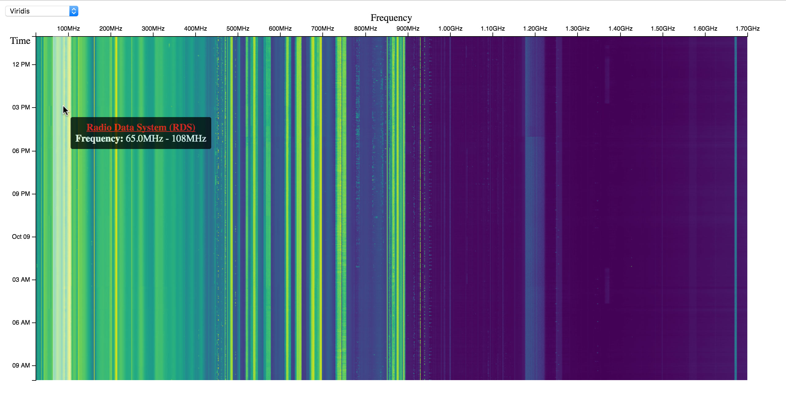

**d3-waterfall** is a [waterfall display](https://en.wikipedia.org/wiki/Spectrogram) for the web, built around [d3.js](https://github.com/d3/d3) using the [`canvas`](https://en.wikipedia.org/wiki/Canvas_element) element from HTML5. It natively supports the CSV file format generated by the [`rtl_power`](https://github.com/keenerd/rtl-sdr) tool for the RTL-SDR (RTL2832U) software-defined radio transceiver, and JSON signal annotations. Features:

* Built using [d3.js](https://github.com/d3/d3) and [HTML5](https://en.wikipedia.org/wiki/HTML5)
* Automatic frequency and time axes labeling
* Configurable color schemes/interpolators (default: [viridis](https://github.com/d3/d3-scale#interpolateViridis))
* Annotated signal tooltips (using [SIGIDWIKI data](http://www.sigidwiki.com/wiki/Signal_Identification_Guide))
* Pan/zoom support

## Usage
For a working example, view [example/index.html](example/index.html) in a web browser.

1. Gather signal data from 24 - 1700 MHz at 1MHz intervals for 24 hrs:

    `rtl_power -f 24M:1700M:1M -i 100 -g 50 -e 24h data.csv`

2. In your webpage, source the d3.js and d3-waterfall libraries:

    ```HTML
    <script src="https://d3js.org/d3.v4.min.js"></script>
    <script src="waterfall.js"></script>
    ```

3. Create a `div` element for the waterfall:

    ```HTML
    <div id="waterfall"></div>
    ```

4. Generate the *frequencies.json* file using the [Signal Identification Guide (SIGIDWIKI)](http://www.sigidwiki.com/wiki/Signal_Identification_Guide), from the *db.csv* file included with the [Artemis 2 offline database](http://markslab.tk/project-artemis):

    `python sigid_csv_to_json.py`

5. Create the waterfall inside the `#waterfall` element, using CSV data from *data.csv*, JSON annotations from *frequencies.json*, with drawing animation enabled, selectable interpolators enabled, and pan/zoom disabled. Then, call `getData` to load the file data, followed by the `initDisplay` callback when done:

    ```JavaScript
    var w = new Waterfall("#waterfall", "data.csv", "frequencies.json", true, true, false);
    getData(w, initDisplay);
    ```
6. When signal annotations are available, a tooltip will appear when hovering over recognized signals. When selectable interpolators are enabled, a drop-down menu is shown to provide changeable color schemes.

## Notes
* Use the [keenerd/rtl-sdr](https://github.com/keenerd/rtl-sdr) fork of the unmaintained [librtlsdr](http://sdr.osmocom.org/trac/wiki/rtl-sdr) to avoid various bugs with `rtl_power`. In the future, these and other fixes should be integrated into the [librtlsdr/librtlsdr](https://github.com/librtlsdr/librtlsdr) maintained fork.
* To optimize web delivery of the raw CSV data from `rtl_power`, it's recommended to eliminate unneeded columns in the data and update the `parseRow()` function accordingly.
* To avoid performance slowdowns when rendering large wideband surveys, the waterfall is drawn onto a `canvas` element, whereas the axes and annotations are drawn onto a `svg` element overlaid on top. When animation is enabled, each row of the waterfall is drawn by a callback from [`window.requestAnimationFrame()`](https://developer.mozilla.org/en-US/docs/Web/API/window/requestAnimationFrame). Otherwise, the waterfall will not be visible until it is fully drawn.
* For optimized pan/zoom performance, the waterfall image is cached after being drawn by storing it as an [ImageBitmap](https://developer.mozilla.org/en-US/docs/Web/API/ImageBitmap). This allows for fast pan/zoom, especially with large wideband surveys, by redrawing only the cached bitmap, instead of the entire waterfall. However, the resolution of this bitmap is limited by the size of the canvas drawing surface, which defaults to the size of the parent DOM element at page load. This could be improved by choosing a higher canvas size that is downsampled for display, or by implementing smart waterfall redraw by limiting it to the position of the current canvas viewport.
* The waterfall drawn on the `canvas` element can be directly saved as an image using the [`toDataURL()`](https://developer.mozilla.org/en-US/docs/Web/API/HTMLCanvasElement/toDataURL) method. This is shown in the example.
* The provided annotation data is converted directly from the *db.csv* file, which contains all known signals from the SIGIDWIKI. Since some signals span very large portions of the radio spectrum, the data is sorted in order of decreasing bandwidth, so that tooltips for signals with smaller bandwidth are drawn on top of those with larger bandwidth. This generally prevents large tooltips from hiding smaller tooltips.
* Feel free to submit pull requests, especially for code structure and repository layout. I'm not a web developer, so this was a learning experience.
